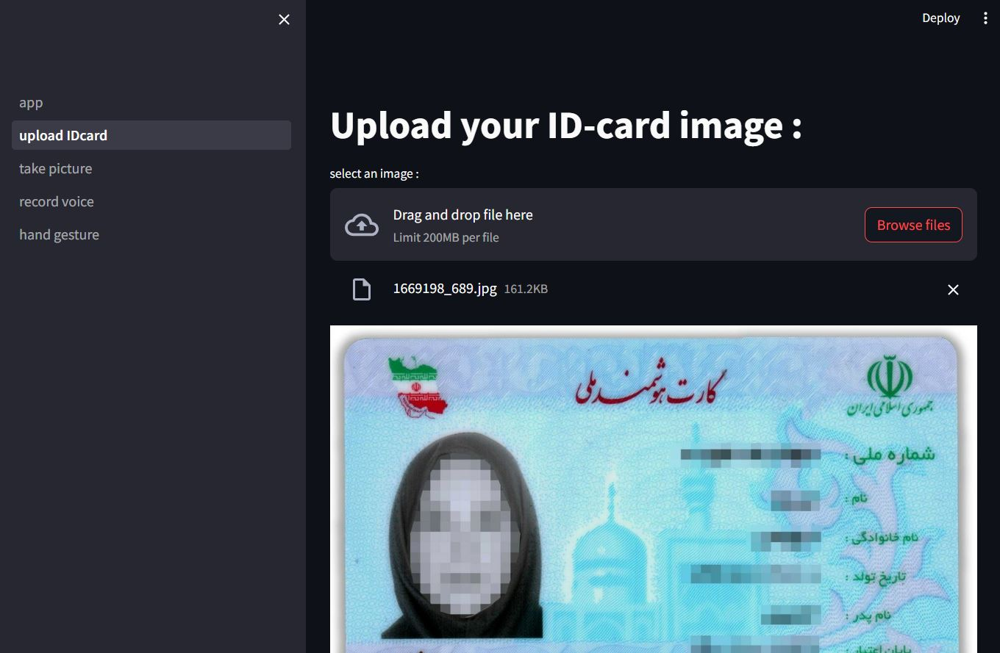
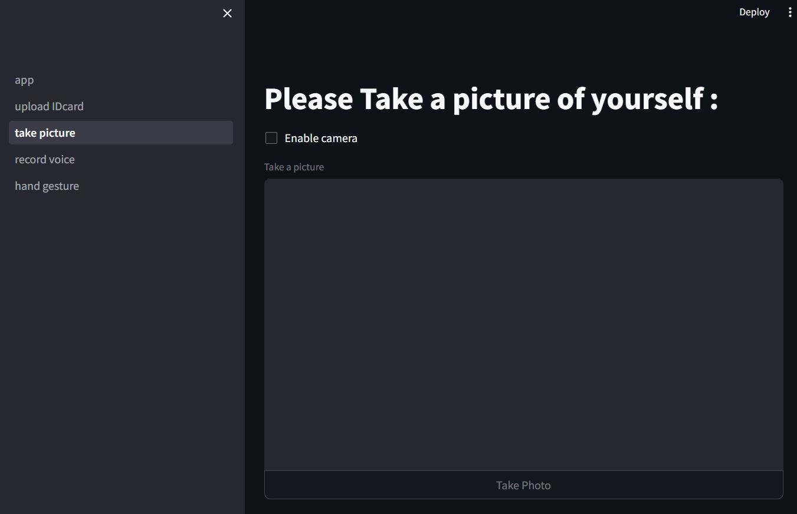
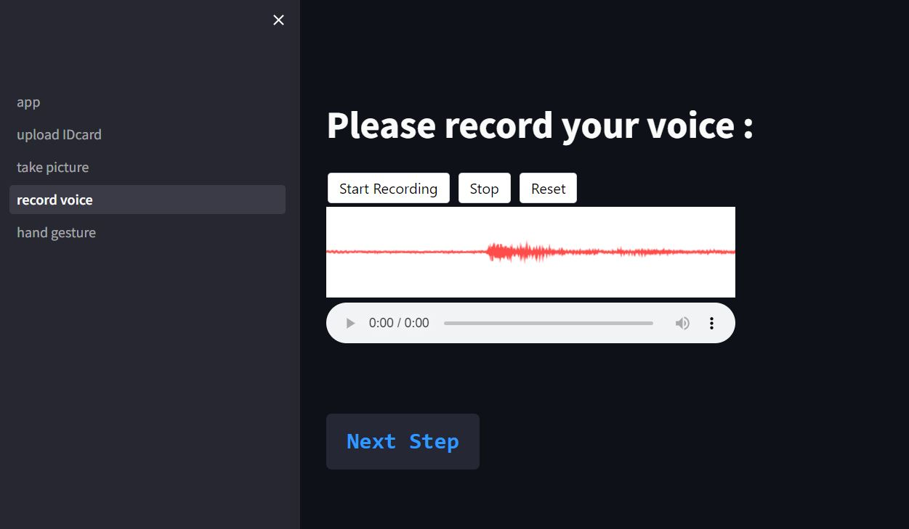
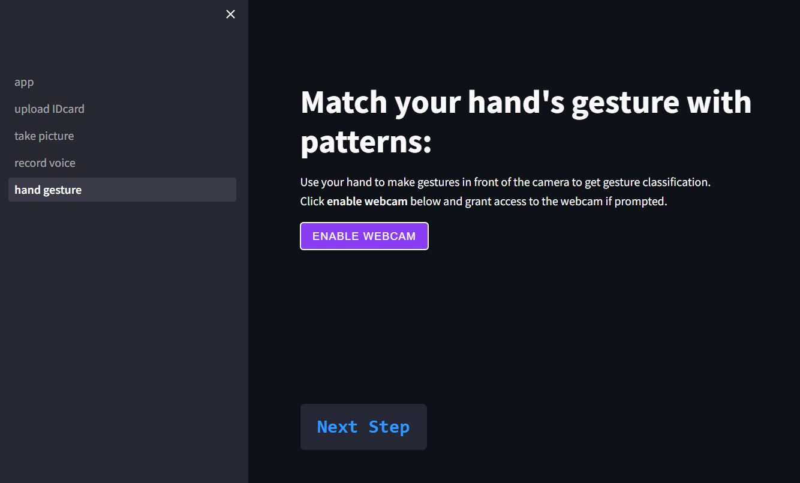

# Frontend using Streamlit:


## How to run :
first run :
```
uvicorn Backend.main:app --reload --host 127.0.0.1 --port 8000
```
then run :
```
streamlit run app.py
```

# 1_ Upload ID-Card :

<p align="center">
    
</p>
<br>

# 2_ Taking picture from yourself :
here , you have to enable camera access with checking the checkbox , then press "Take Photo" :
<p align="center">
    
</p>

<br>

# 3_ Record your voice :

<p align="center">

</p>

<br>

+ ## Here we have 2 options for recording voice in streamlit :

### [1_ streamlit-audiorec:](https://github.com/stefanrmmr/streamlit-audio-recorder)


how to install :

```
pip install streamlit-audiorec
```

But Here , i DIDN'T INSTALL this package with pip (pip install streamlit-audiorec), i have colned streamlit-audiorec repository and modified it (removed delete button from ui). <br>
And i have import its main function like this :<br>
 ``` from streamlit_audio_recorder.st_audiorec.__init__ import st_audiorec ``` in ```3_record_voice.py``` .


### [2_ streamlit-audiorecorder :](https://github.com/theevann/streamlit-audiorecorder)
how to install :
```
pip install streamlit-audiorecorder
```

# 4_ Math your hand gesture :
You should press enable webcam button :
<p align="center">

</p>


### how to connect streamlit into MongoDB :
https://docs.streamlit.io/develop/tutorials/databases/mongodb